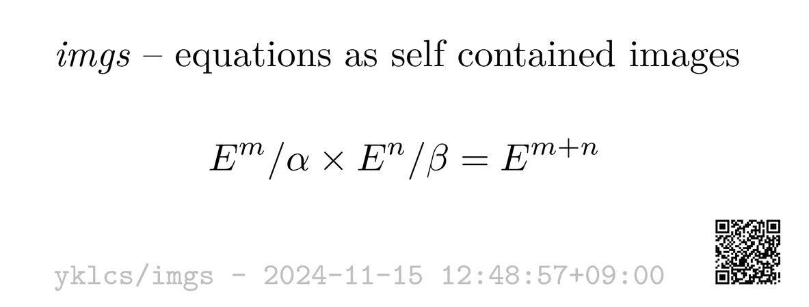

# imgs

Theorems, proofs, equations, and other interesting tidbits in the form of self-contained images.



## Building

The [Makefile](./Makefile) builds each source with `latexmk` (pdfTeX), then converts the PDFs to PNGs with `magick`.
A [custom $\LaTeX$ class file](./imgs.cls) is used.

```shell
$ make
```

## Tagging

Files are tagged in the form of `%#tag` for greppability.
For example, searching for sources related to automata theory:

```shell
$ rg "%#automata"
$ grep -rl "%#automata"
```
